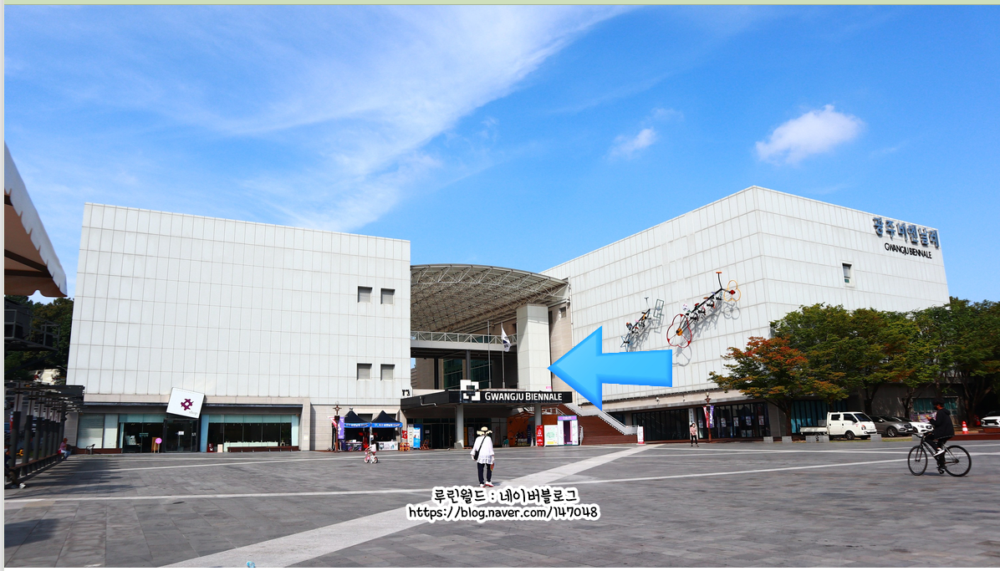
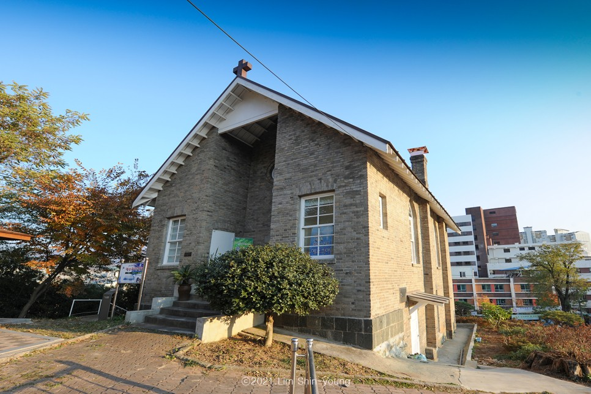
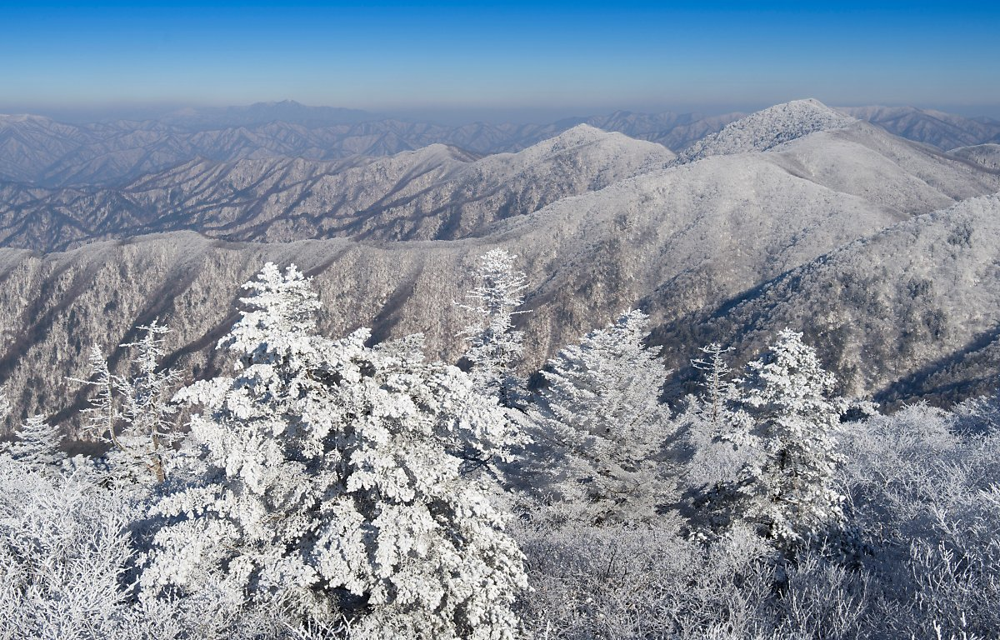
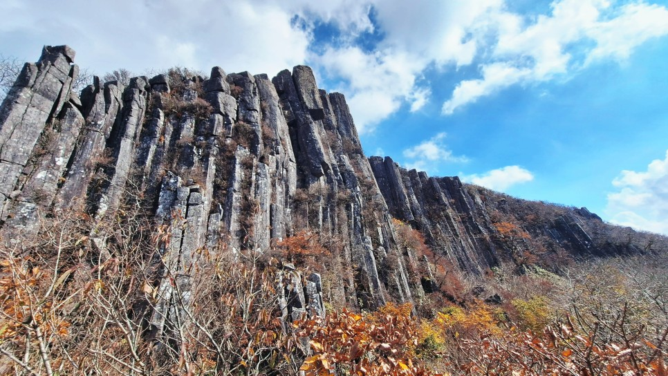
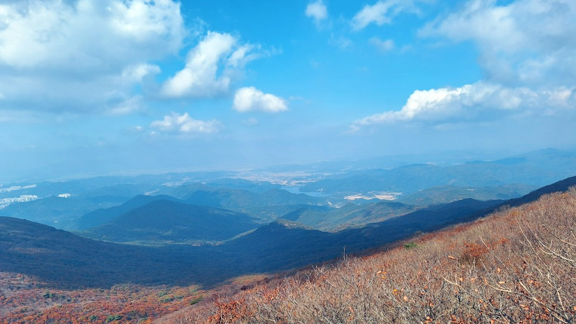

# The Heart of Korean Culture and Cuisine
## Gwangju's Rich Heritage

Gwangju, situated in the southwestern part of South Korea, is a city of historical significance and vibrant culture. Renowned for its artistic community and rich culinary traditions, Gwangju is a destination that offers an authentic Korean experience.

### Top Attractions

1. **Gwangju Biennale**: An international art festival that showcases cutting-edge contemporary art from around the globe.

2. **5.18 Memorial Park**: A place of remembrance and peace, dedicated to the May 18 Democratic Uprising 

3. **Mudeungsan National Park**: Known for its majestic mountain peaks and beautiful hiking trails 

4. **Gwangju National Museum**: Explore the rich history and art of the region, with a collection that spans centuries.

### Visual Highlight

- **{image_id 606}**: This stunning image captures the essence of Gwangju's natural beauty, with lush greenery and mountainous backdrops.

## Gwangju's Culinary Scene

Gwangju is celebrated for its diverse and flavorful cuisine, heavily influenced by the region's rich agricultural heritage.

### Must-Try Dishes

1. **Gwangju Kimchi**: Known for its distinct taste and high-quality ingredients.
2. **Tteokgalbi (Grilled Short Rib Patties)**: A savory and tender local specialty.
3. **Hongeo (Fermented Skate)**: A unique and pungent dish for the adventurous foodie.
4. **Bibimbap**: A Korean classic, with Gwangju offering its own regional twist.
5. **Sundubu Jjigae (Soft Tofu Stew)**: A spicy and comforting staple in Gwangju's culinary repertoire.

### Dining Recommendation

- **{image_id 623}**: Experience the vibrant and diverse flavors of Gwangju at this popular local eatery, known for its authentic dishes.

## Where to Stay in Gwangju: Top 5 Hotels

Based on reviews and proximity to key attractions, here are the top 5 hotels in Gwangju:

| Hotel Name | Pros | Cons | Reviews | Cost per Night |
|------------|------|------|---------|----------------|
| Ramada Plaza Gwangju | Luxurious amenities, central location | Pricier option | 4.5 stars | ~$200 |
| Holiday Inn Gwangju | Comfortable, suitable for families | Can be busy | 4.4 stars | ~$150 |
| Gwangju Guesthouse | Budget-friendly, cozy atmosphere | Basic facilities | 4.2 stars | ~$50 |
| U Square Hotel | Modern and stylish, near transport hubs | Limited dining options | 4.3 stars | ~$120 |
| Firenze Tourist Hotel | Great value, convenient location | Smaller rooms | 4.1 stars | ~$80 |

Each of these hotels offers a unique experience, perfect for different types of travelers visiting Gwangju.

## Conclusion

Gwangju, with its rich history, thriving art scene, and delicious cuisine, is a must-visit destination in South Korea. From exploring its historical sites to indulging in local flavors, Gwangju provides a memorable experience for all who visit.
